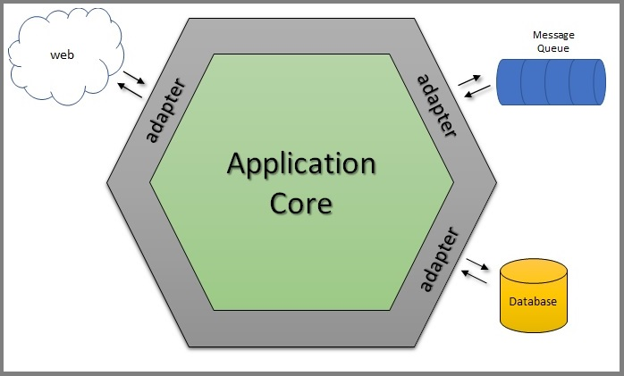

# genealogy-tree
Aplicação responsável por gerar árvore genealógica de uma pessoa

### Tecnologias
 * [linguem de programação] [Golang versão 1.19](https://go.dev/)
 * [framework API] [Echo for golang](https://echo.labstack.com/)
 * [framework validação de campos da estrutura] [Govalidator](https://github.com/asaskevich/govalidator)
 * [banco de dados] [SQLITE](https://www.sqlite.org/index.html)
 * [virtualização] [Docker versão 20.10.17](https://www.docker.com/)
 * [request-collection] [postman versão 9.27.0](https://www.postman.com/)

### Endpoints
  * Person
    * `[POST] /v1/person -> Cadastrar uma nova pessoa`
    * `[PUT] /v1/person/{{PERSON_ID}} -> Atualizar o cadastro da pessoa`
    * `[GET] /v1/person/{{PERSON_ID}} -> Consultar uma pessoa`
    * `[GET] /v1/person -> Listar todas as pessoa`
  * Relationship
    * `[POST] /v1/relationship -> Criar um novo relacionamento`

Para facilitar o consumo da API, há uma [coleção de request](genealogy-tree.postman_collection.json) pré-definidas que pode ser usadas utilizando a ferramenta [postman versão 9.27.0+](https://www.postman.com/). \
Basta importar essa coleção de request para o Postman. Quando importada, você terá uma collection chamada `genealogy-tree` e nessa collection terão os [endpoints](#endpoints) separados por pastas.

### Instalação e build
A aplicação necessita do [Docker](https://www.docker.com/) para realização da instalação/implantação, [Docker compose](https://docs.docker.com/desktop/install/linux-install/) e a linguagem de programação [Golang versão 1.19+](https://go.dev/).

### Deploy da aplicação
Para realização do deploy da aplicação, basta estar dentro do repositório do projeto e usar o executor de macros Makefile
```bash 
$ make deploy-app
```
OU 
Pode-se usar os comandos docker via bash dentro do repositório da aplicação
```bash 
$ docker-compose build --no-cache && docker-compose down -v --remove-orphans && docker-compose up -d --force-recreate
```

Após o deploy da aplicação, a API estará disponível através do endereço http://localhost:9000/  

# Informações para desenvolvimento

### Gerar um novo banco de dados para realização do desenvolvimento
Usando o executor de macros Makefile, basta digitar no bash
```bash 
$ make reset-database-dev
```

### Definindo o local do banco de dados
Para informar para aplicação onde está o banco de dados pasta setar a variável de ambiente `DATA_SOURCE_APP` \
Caso esteja executando a aplicação em modo debug pelo [VSCode](https://code.visualstudio.com/) este parâmetro já está \
definido então o banco dados será carregado a partir do diretório raiz do repositório do projeto

### Gerar mock tests
Utilizar o framework de mock disponível em [gomock](https://github.com/golang/mock) \
Seguir as instruções disponíveis em [gomock-install](https://github.com/golang/mock#go-116) \
Gerar mocks:
```bash
GOPATH=$(go env GOPATH) ~/go/bin/mockgen -source=$(pwd)/<path_interface> -destination=$(pwd)/mocks/<path_mocks>
```
Ou poderá realizar a geração dos mocks a partir do comando. A partir desse comando irá reconhecer todas a interfaces e gerar os mocks
```bash
make generate-mocks
```

## Arquitetura utilizada no projeto - Hexagonal


